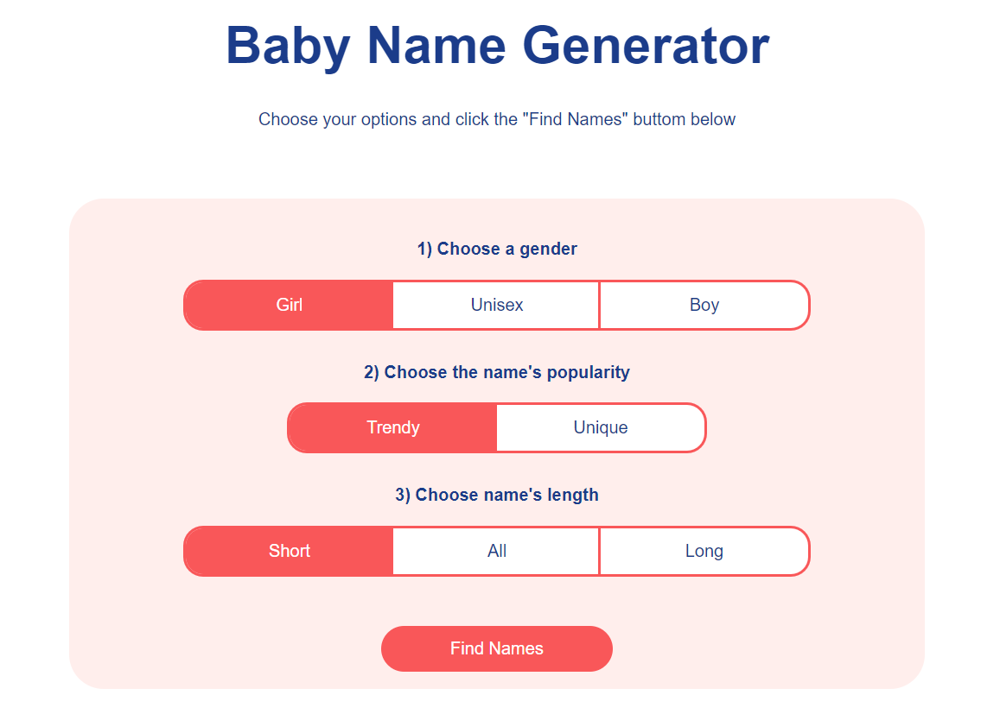

# Baby Name Generator

<p align="center">
   <a href="https://www.linkedin.com/in/lucas-figueiredo-007-/">
      
   </a>
</p>

> O projeto consiste em um modulo dentro do The Nuxt 3 Bootcamp proposto pelo instrutor em seu curso na Udemy, no desafio foi desenvolvida uma aplicação do zero que siula um gerador de nomes de bebês utilizando algumas diretrizes para filtrar os resultados.

## Fotos

<div>
   
</div>

## 💻 Tecnologias

Este projeto foi feito utilizando as seguintes tecnologias:

- [Vue](https://vuejs.org/)
- [TypeScript](https://www.typescriptlang.org)
- [Nuxt](https://nuxtjs.org/)

## 🛠️ Executando

```bash
# Clone o Repositório
$ git clone https://github.com/lucasbf7/Baby-Name-Generator.git
```

```bash
# Entre na pasta do projeto e baixe as dependendências
$ npm install
```

```bash
# Execute o projeto
$ npm run dev
```

Acesse <http://localhost:3000/> para ver o resultado.
